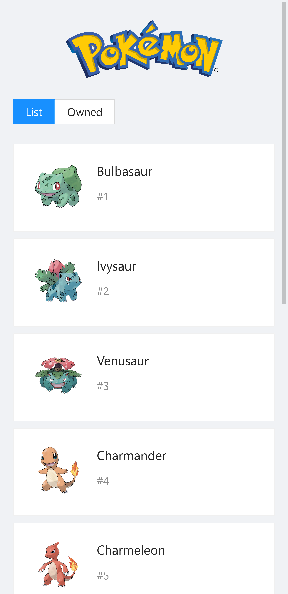
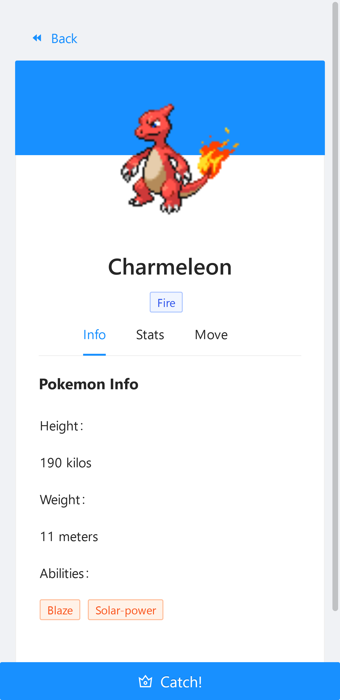
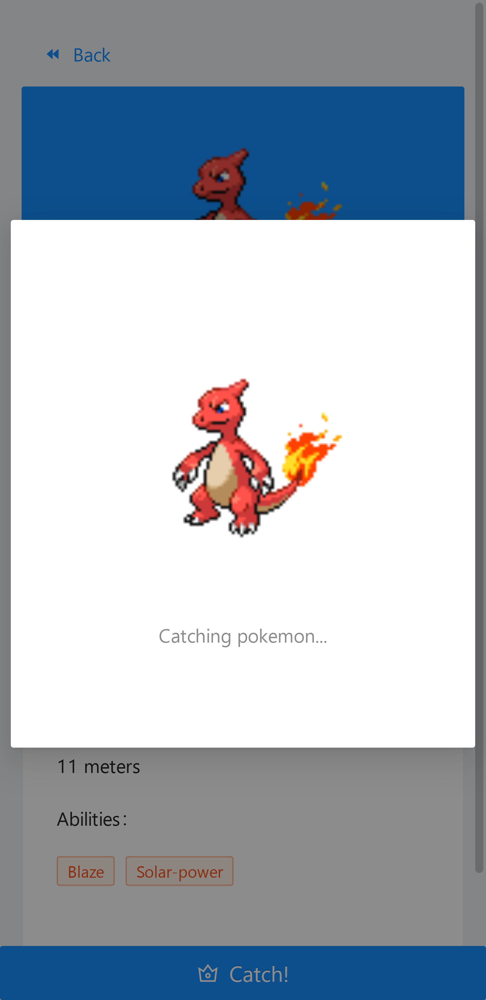
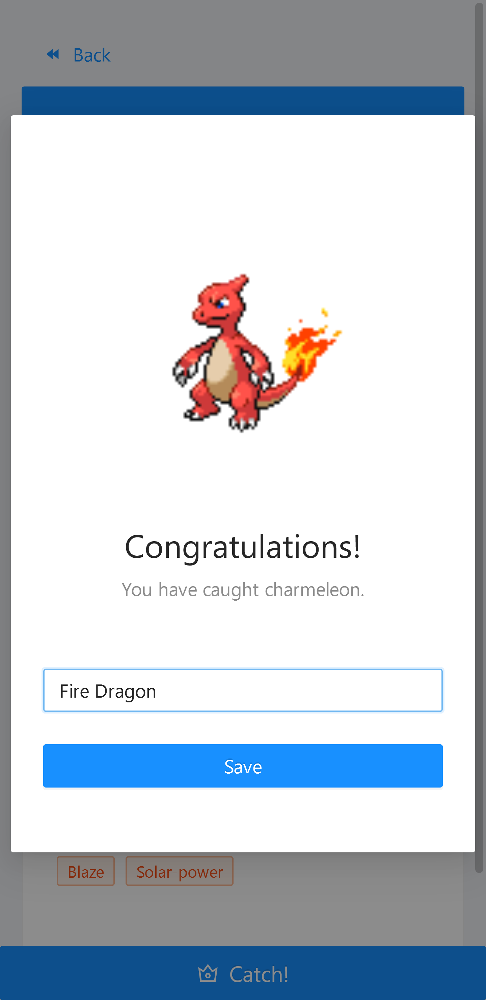
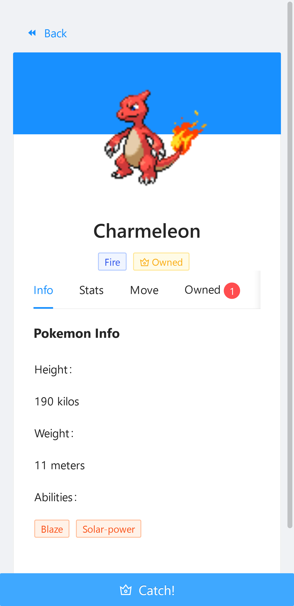

# Pokemon Catch! App

	

## Deployed App

Visit [https://pokemon-catch-one.vercel.app](https://pokemon-catch-one.vercel.app/).

## Features

	
	
	
	
	

## Credits

- [React](https://github.com/facebook/react)
- [React Redux](https://github.com/reduxjs/react-redux)
- [GraphQL PokeAPI](https://github.com/mazipan/graphql-pokeapi)
- [Vercel](https://vercel.com/)

---

Copyright © By Muhammad Rizal Fauzy
